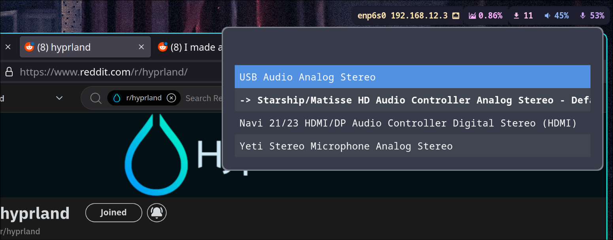

# waybar_wireplumber_audio_changer
A script that uses wofi and wpctl to change audio sinks. Can be used with waybar to make a clickable audio sink changer

Needs to have wofi installed, as well as wireplumber in order to use the wpctl command.



# How to Install  
copy the ```audio_changer.py``` file to your ```~/.config/waybar/scripts/``` folder.   
Then: ```chmod +x audio_changer.py```    
You can then add it to the .config/waybar/config.jsonc file under pulseaudio **'onclick'** property as below:  
```"pulseaudio": {
        "format": "{icon} {volume}%",
        "tooltip": false,
        "format-muted": " Muted",
        "on-click": "~/.config/waybar/scripts/audio_changer.py",
        "on-scroll-up": "pamixer -i 5",
        "on-scroll-down": "pamixer -d 5",
        "scroll-step": 5,
        "format-icons": {
            "headphone": "",
            "hands-free": "",
            "headset": "",
            "phone": "",
            "portable": "",
            "car": "",
            "default": ["", "", ""]
        }
    },
```

# Keybinding in hypr.conf
You can also add a bind in the ```~/.config/hypr/hyprland.conf``` file as so:  
```bind = , F4, exec, ~/.config/waybar/scripts/audio_changer.py```
